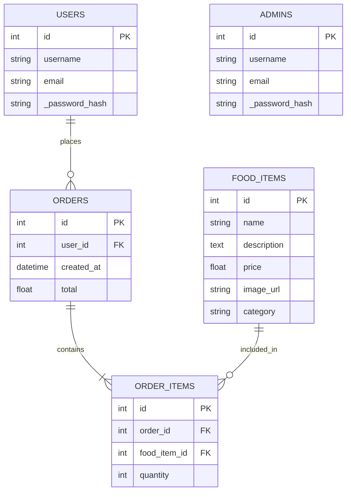

# **Taste Town API**


<p align="center">
  
</p>


> A secure, **JWT-authenticated Flask API** for managing an online food ordering system. Features include User/Admin registration and login, food catalog management, ordering and token blacklisting.

---
## **Live Deployment**

Hosted on **Render**: [Visit production URL](https://brom-e-commerce-backend.onrender.com/)

## **Requirements**

- Python 3.12+
- PostgreSQL database
- JWT authentication (access & refresh tokens)
- Models: `User`, `Admin`, `FoodItem`, `Order`, `OrderItem`, `TokenBlocklist`
- Role-based access control
- Modular Blueprints and controller structure

## **Setup**

### **Pre-Requisites**

- OS: **Windows 10+, Linux 3.8+, or MacOS X 10.7+**
- Python: **3.12+**
- PostgreSQL: installed and configured
- Pipenv (recommended)
- Postman(for API testing): [Download](https://www.postman.com/)
- RAM: 2GB+ | Disk space: 1GB+

---

## **Installation**

1. Clone this repository:
   ```bash
   git clone https://github.com/BROM-town-square/brom-e-commerce-backend 
   ```

2. Navigate to the project directory:
   ```bash
   cd brom-e-commerce-backend
   ```

3. Install dependencies:
   ```bash
   pipenv install
   ```

4. Activate python environment:
   ```bash
   pipenv shell

## **PostgreSQL Setup**

Create the database:

```bash

CREATE DATABASE taste_town_db;

```
## **Create `.env` File**

At the root of project, create a `.env` file:

```bash

DATABASE_URI=postgresql://<username>:<password>@localhost:5432/taste_town_db
JWT_SECRET_KEY=<your_super_secret_key>
SECRET_KEY=<your_super_secret_key>

```
## **Migrations & Seeding**

> Make sure to set the Flask app factory path before running migrations:

```bash

export FLASK_APP=server.app:create_app

```
Then:
> **NOTE:** Run `flask db init` **only once**,  and only if the `migrations/` folder does not already exist.

```bash

flask db init        
flask db migrate -m "Initial migration"
flask db upgrade

```
To seed the database:

```bash

python -m server.seed

```

## **Run the Server**

Use the `run.py` script to start the API:

```bash

python run.py

```
The app runs at:

```bash

http://127.0.0.1:5555

```

## **Project Structure**

```bash

.
├── migrations
│   ├── alembic.ini
│   ├── env.py
│   ├── README
│   ├── script.py.mako
│   └── versions
│       ├── 0427c5822a09_change_jti_column_to_text.py
│       ├── d6d9272325ab_initial_migration.py
│       └── f09213ea016e_reset_migration.py
├── Pipfile
├── Pipfile.lock
├── Procfile
├── README.md
├── render.yaml
├── requirements.txt
├── run.py
├── runtime.txt
└── server
    ├── app.py
    ├── config.py
    ├── controllers
    │   ├── auth_routes.py
    │   ├── food_routes.py
    │   ├── order_routes.py
    │   └── user_routes.py
    ├── models
    │   ├── admin.py
    │   ├── food_item.py
    │   ├── __init__.py
    │   ├── order_item.py
    │   ├── order.py
    │   ├── token_blocklist.py
    │   └── user.py
    ├── __pycache__
    │   └── app.cpython-312.pyc
    └── seed.py

```

## **API Routes Summary**

| Method | Endpoint                      | Auth Required  | Role    | Description                       |
|--------|-------------------------------|----------------|---------|-----------------------------------|
| POST   | `/api/auth/user/register`     | No             | Public  | Register a new user               |
| POST   | `/api/auth/user/login`        | No             | Public  | Login as user                     |
| POST   | `/api/auth/admin/register`    | No             | Public  | Register as admin                 |
| POST   | `/api/auth/admin/login`       | No             | Public  | Login as admin                    |
| POST   | `/api/auth/logout`            | Yes            | Both    | Logout & blacklist token          |
| POST   | `/api/auth/refresh`           | Yes (refresh)  | Both    | Refresh access token              |
| GET    | `/api/food`                   | No             | Public  | List all food items               |
| POST   | `/api/food`                   | Yes            | Admin   | Create a food item                |
| GET    | `/api/food/<id>`              | No             | Public  | Get food item by ID               |
| PATCH  | `/api/food/<id>`              | Yes            | Admin   | Update food item by ID            |
| DELETE | `/api/food/<id>`              | Yes            | Admin   | Delete food item by ID            |
| GET    | `/api/orders`                 | Yes            | User    | List user’s orders                |
| POST   | `/api/orders`                 | Yes            | User    | Create a new order                |
| POST   | `/api/orders/<id>/items`      | Yes            | User    | Add item to order                 |
| GET    | `/api/users/me`               | Yes            | User    | Get logged-in user's profile      |
| PATCH  | `/api/users/me`               | Yes            | User    | Update user's profile             |
| PATCH  | `/api/users/me/password`      | Yes            | User    | Change password                   |
| DELETE | `/api/users/me`               | Yes            | User    | Delete own account                |
| GET    | `/api/users/admin/users`      | Yes            | Admin   | Admin can view all users          |


## **Authentication Routes**

### **POST `/api/auth/user/register`**

Registers a new user.

```json

{
  "username": "janedoe",
  "email": "jane@example.com",
  "password": "securePass123"
}

```

**Response**

```json

{
  "message": "User registered successfully"
}

```

### **POST `/api/auth/user/login`**

Authenticates a user and returns access and refresh tokens.

```json

{
  "username": "janedoe",
  "password": "securePass123"
}

```
**Response**

```json

{
  "access_token": "<JWT_ACCESS_TOKEN>",
  "refresh_token": "<JWT_REFRESH_TOKEN>"
}

```

use this token in headers:

```makefile

Authorization: Bearer <JWT_ACCESS_TOKEN>

```

### **POST `/api/auth/logout`**

Revokes current token (Works for both access and refresh tokens).

**Headers**

```makefile

Authorization: Bearer <JWT_TOKEN>

```

**Response**

```json

{
  "message": "Access token revoked successfully"
}

```
### **POST `/api/auth/refresh`**

Generate a new access token using a refresh token.

**Headers**

```makefile

Authorization: Bearer <JWT_REFRESH_TOKEN>

```

**Response**

```json

{
  "access_token": "<NEW_JWT_ACCESS_TOKEN>"
}

```

## **Food Routes**

### **GET `/api/food`**

Publicly fetch all available food items.

**Response**

```json

[
  {
    "id": 1,
    "name": "Burger",
    "price": 8.99,
    "description": "Grilled beef with cheese",
    "category": "Fast Food"
  }
]

```

### **POST `/api/food` (Admin only)**

Create a new food item.

```makefile

Authorization: Bearer <JWT_ACCESS_TOKEN>

```

**Body**

```json

{
  "name": "Pizza",
  "description": "Cheesy",
  "price": 12.5,
  "category": "Italian",
  "image_url": "http://image.png"
}

```
## **Order Routes**

### **GET `/api/orders`**

Returns all orders belonging to the authenticated user.

```http

Authorization: Bearer <JWT_ACCESS_TOKEN>

```
**Response**

```json

[
  {
    "id": 1,
    "user_id": 2,
    "total": 24.5,
    "items": [...]
  }
]

```

### **POST `/api/orders/<order_id>/items`**

Adds a food item to an existing Order.

```json

{
  "food_item_id": 3,
  "quantity": 2
}

```

## **User Routes**

### **GET `/api/users/me`**

Returns the profile of the logged-in-user.

```http

Authorization: Bearer <JWT_ACCESS_TOKEN>

```
**Response**

```json

{
  "id": 4,
  "username": "janedoe",
  "email": "jane@example.com"
}

```

### **PATCH `/api/users/me/password`**

Updates the user's password.

**Body**

```json

{
  "current_password": "oldPass",
  "new_password": "newSecurePass123"
}

```

### **GET `/api/users/admin/users` (Admin only)**

Return a list of all registered users.

**Headers**

```makefile

Authorization: Bearer <JWT_ACCESS_TOKEN>

```

**Response**

```json

[
  {
    "id": 1,
    "username": "janedoe",
    "email": "jane@example.com"
  },
  ...
]

```

## **Model Relationship**

- A `User` can place many `Orders`.
- An `Order` contains multiple `OrderItems`.
- An `OrderItem` relates a `FoodItem` to an `Order`.
- Admins manage the food catalog.
- JWT token revocation is tracking with `TokenBlocklist`

## **Entity Relationship Diagram**



## **Tech Stack**

| Tool / Library         | Description                                   |
|------------------------|-----------------------------------------------|
| **Python 3.12**        | Core language                                 |
| **Flask**              | Web framework                                 |
| **Flask-RESTful**      | Simplifies resource routing                   |
| **Flask-JWT-Extended** | Handles JWT authentication                    |
| **Flask-Migrate**      | Database migrations                           |
| **Flask-CORS**         | Cross-origin request support                  |
| **SQLAlchemy**         | ORM for database interaction                  |
| **PostgreSQL**         | Relational database                           |
| **Pipenv**             | Dependency management                         |
| **dotenv**             | Secure environment configuration              |
| **Postman**            | API route testing                             |


---

## **Authors**

- [Richard Wasonga](https://github.com/Richard3wasonga)

- [Nevil Oporo](https://github.com/Neviloporo)

- [Brian Njuguna](https://github.com/NJUGUNA-png)

- [Joy Mitchel](https://github.com/JoyMitchel)


## **Contributing**

Pull requests are welcome! For major changes, please open an issue first to discuss your ideas.

---

## **License**

This project is open-source and available under the MIT License.


